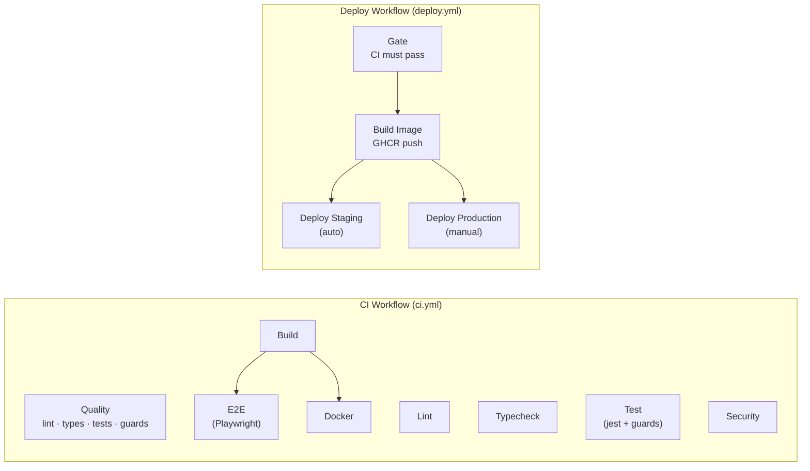

# CI/CD Pipeline

> Enterprise-grade GitHub Actions pipeline for Inflect Compliance.

## Job Graph



**Lint**, **Typecheck**, **Test**, **Build**, and **Security** all run in parallel. **E2E** and **Docker** wait for Build to pass.

## Workflows

### CI (`ci.yml`)

| Job | Trigger | Needs Postgres? | Blocks merge? | What it does |
|---|---|---|---|---|
| Lint | PR + push | No | ✅ Yes | `next lint` (ESLint) |
| Typecheck | PR + push | No | ✅ Yes | `tsc --noEmit` |
| Test | PR + push | ✅ Yes | ✅ Yes | Jest (unit + integration) + architectural guard tests |
| Build | PR + push | No | ✅ Yes | `next build` (production) |
| E2E | After Build | ✅ Yes | ✅ Yes | Playwright against `next start` |
| Security | PR + push | No | ⚠️ Advisory | `npm audit`, dependency-review-action |
| Docker | After Build | No | ✅ Yes | Dockerfile build verification |

### Deploy (`deploy.yml`)

| Job | Trigger | What it does |
|---|---|---|
| Gate | CI passes on main | Blocks deploy if CI failed |
| Build Image | After gate | Builds + pushes to GHCR |
| Deploy Staging | Auto on main push | SSH → docker compose up |
| Deploy Production | Manual dispatch | SSH → docker compose up (requires approval) |

### Dependabot (`dependabot.yml`)

- **npm**: weekly (Monday 08:00), grouped by prod/dev deps
- **GitHub Actions**: monthly, grouped

## Secrets & Environment Model

### CI (no secrets needed)

CI uses hardcoded dummy values defined in `ci.yml` `env:` block:
- `DATABASE_URL` — local Postgres service container
- `AUTH_SECRET` / `NEXTAUTH_SECRET` — dummy signing keys
- `GOOGLE_CLIENT_ID/SECRET`, `MICROSOFT_*` — dummy SSO values
- `FILE_STORAGE_ROOT` — `/tmp/ci-uploads`

### Deploy Environments

Configure in GitHub → Settings → Environments:

#### `staging` Environment

| Secret | Description |
|---|---|
| `DEPLOY_HOST` | SSH hostname of staging server |
| `DEPLOY_USER` | SSH username |
| `DEPLOY_SSH_KEY` | Private SSH key (Ed25519 recommended) |
| `DEPLOY_PATH` | App directory (default: `/opt/inflect-compliance`) |

#### `production` Environment

Same secrets as staging, pointed at production server.

**Required protection rules:**
- ✅ Required reviewers (at least 1 approver)
- ✅ Wait timer (optional, e.g. 5 minutes)
- ✅ Restrict to `main` branch only

#### Environment Variables (vars, not secrets)

| Variable | Environment | Description |
|---|---|---|
| `STAGING_URL` | staging | Public URL for deployment status |
| `PRODUCTION_URL` | production | Public URL for deployment status |

## Branch Protection

Configure on `main` branch (GitHub → Settings → Branches):

| Setting | Value |
|---|---|
| Require pull request reviews | 1 reviewer minimum |
| Require status checks | `Lint`, `Typecheck`, `Test`, `Build`, `E2E`, `Docker` |
| Require branches to be up to date | ✅ |
| Require linear history | Recommended |
| Include administrators | ✅ |
| Allow force pushes | ❌ |
| Allow deletions | ❌ |

## Docker

### Multi-stage Dockerfile

```
Stage 1: deps      → npm ci (cached layer)
Stage 2: builder   → prisma generate + next build
Stage 3: runner    → alpine, non-root user, entrypoint.sh
```

### `.dockerignore`

Excludes `.git`, `node_modules`, `.next`, tests, docs, env files — keeps context fast and secure.

### Build locally

```bash
docker build -t inflect-compliance .
docker run -p 3000:3000 --env-file .env.staging inflect-compliance
```

### Deploy with compose

```bash
# Staging
docker compose -f docker-compose.staging.yml up -d --build

# Production
docker compose -f docker-compose.prod.yml up -d --build
```

## Local CI

For running CI checks locally, see [ci-local.md](ci-local.md).
